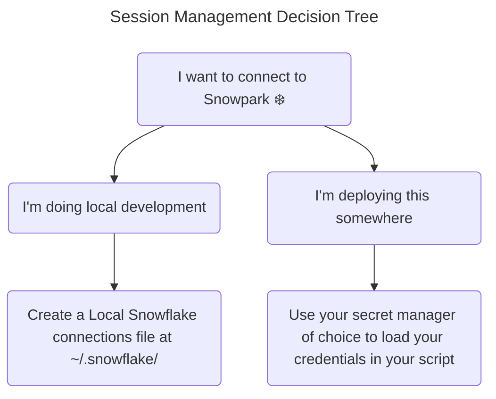
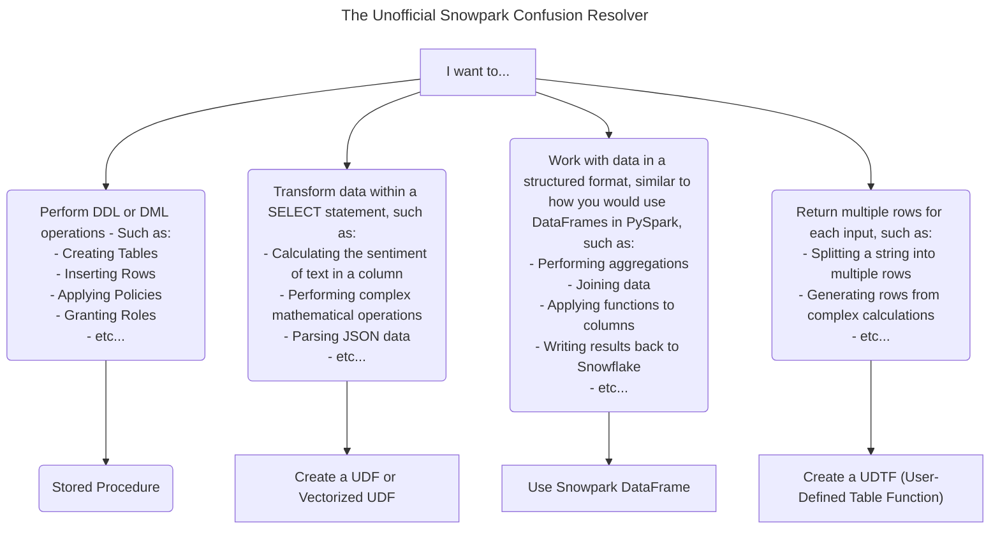
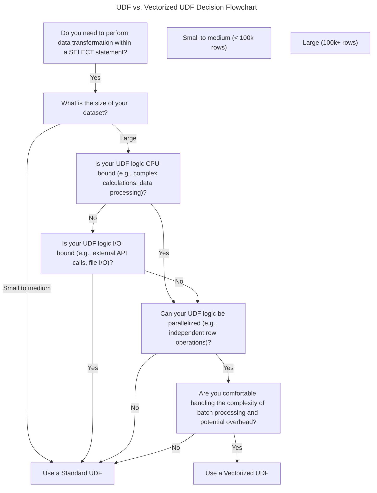

# Branden's Unofficial Snowpark Guide

Author: Branden Ciranni, Solutions Engineer @ Snowflake ❄️   
Email: branden.ciranni@snowflake.com

### TLDR: Writing good code is better than writing bad code :)

In this guide, I'll give you some pointers on writing better code with Snowpark, and hopefully making your life a bit easier.


## 1. Less Bulky Session Management

Starting off with managing sessions, one of the most annoying things you can possibly do is specify your credentials every time you want to use snowflake to log in, and in production you definitely do not want to be hard-coding your login. Have you done this before to connect every time...?

```python
# Don't do this every time...
connection_parameters = {
   "account": "<your snowflake account>",
   "user": "<your snowflake user>",
   "password": "<your snowflake password>",
   "role": "<your snowflake role>",  # optional
   "warehouse": "<your snowflake warehouse>",  # optional
   "database": "<your snowflake database>",  # optional
   "schema": "<your snowflake schema>",  # optional
}

new_session = Session.builder.configs(connection_parameters).create()
```

For local dev, don't. Here's what I would do:



### Local Development

#### Creating a Connection

---

Let's start off by seeing if we have a `~/.snowflake` directory already...

```bash
test -d ~/.snowflake/
```

If you don't have one, go ahead and create a `~/.snowflake` directory.

```bash
mkdir ~/.snowflake
```

and within here, we need to make a file `connections.toml`.

If you're logging in with User/Password:

```toml
[your_user_pass_connection]
name = "your_connection_name"
account = "your_account"
user = "your_user"
authenticator = "snowflake"
password = "your_password"
database = "your_database"
schema = "your_schema"
warehouse = "your_warehouse"
role = "your_role"
```

If you're using SSO:

```toml
[your_sso_connection]
name = "your_connection_name"
account = "your_account"
user = "your_user"
authenticator = "externalbrowser"
database = "your_database"
schema = "your_schema"
warehouse = "your_warehouse"
role = "your_role"
```

Now, to connect to snowpark:

```python
from snowflake.snowpark import Session

connection_name = "your_connection_name_here"
session = Session.builder.config("connection_name", connection_name).create()
```

That's a bit easier and cleaner...

### Deployments + Flexibility for Local Testing

For deployments, you probably want to use a secrets manager. You might have your credentials as environment variables. However you do it, you'll want some flexibility. Here's how I set it up with environment variables that I'll pull from where I manage secrets in github.

```python
import os
from snowflake.snowpark import Session

def authenticate_from_env() -> Session:
    """Authenticate to Snowflake using environment variables."""
    connection_params = {
    "account": os.getenv("SNOWFLAKE_ACCOUNT"),
    "user": os.getenv("SNOWFLAKE_USER"),
    "password": os.getenv("SNOWFLAKE_PASSWORD"),
    "role": os.getenv("SNOWFLAKE_ROLE"),
    "warehouse": os.getenv("SNOWFLAKE_WAREHOUSE"),
    "database": os.getenv("SNOWFLAKE_DATABASE"),
    "schema": os.getenv("SNOWFLAKE_SCHEMA"),
    }
    return Session.builder.configs(connection_params).create()


def authenticate_from_local(connection_name: str) -> Session:
    """Authenticate to Snowflake using a local configuration TOML file stored at ~/.snowflake/connections/.

    Args:
        connection_name: The name of the connection in the local configuration file.

    Returns:
        A Snowpark session object.
    """
    return Session.builder.config("connection_name", connection_name).create()


def authenticate(local: bool = False, connection_name: str = None) -> Session:
    """Authenticate to Snowflake using either environment variables or a local configuration file.

    Args:
        local: Whether to use a local configuration file.
        connection_name: The name of the connection in the local configuration file.

    Returns:
        A Snowpark session object.
    """
    if local:
        return authenticate_from_local(connection_name)
    return authenticate_from_env()
```

### Wrap-up

So now you can authenticate pretty easily. If you want to use my functions, feel free, and you can:

```python
session = authenticate(local=True, connection_name='my_connection_name')
```

Otherwise - hope this makes it easier and cleaner regardless.


## 2. Choices Choices: UDFs and Stored Procs and DataFrames, oh my! ... What do I use?

So you wouldn't be alone if you asked, when should I use a
- **UDF**
- **Vectorized UDF**
- **Stored Procedure**
- How do **Snowpark Dataframes** fit in here...?
- **UDTF** (User Defined Table Functions)

Let's make another flowchart :)

---



---

You might still be asking, when should I use a UDF vs. a Vectorized UDF?




## 3. General Best Practices

Whether you create a UDF, Procedure, anything you're trying to do, there are some things you might want to keep in mind.

Temporary UDF's are like lambda functions in Python. They're great for quick, one-off transformations, but they're not reusable, and they're not as performant as permanent UDFs.

### 3.1 Temporary vs Permanent UDFs

If you're creating a UDF that you'll use often, consider making it permanent. This way, you don't have to recreate it every time you want to use it.

The reasons for this:
- **Performance**: Permanent UDFs are stored in the database, so they don't have to be recreated every time you want to use them, spending unnecessary time.

- **Security**: Permanent UDFs can have more granular access controls. You can manage permissions on these UDFs to ensure that only authorized users can execute them.

- **Reusability**: Permanent UDFs can be reused across multiple sessions, queries, and even different users, promoting code reuse and reducing redundancy.

- **Version Control, Management, Documentation**: Permanent UDFs allow for better version control and management. You can update the UDFs centrally, and all dependent queries will use the updated logic without needing to redefine the UDFs in each query. You can also document the UDFs for better understanding and maintenance.

### 3.2 Data Types

When working with UDFs, make you to be explict about the data types you're working with. This will help Snowflake optimize the query execution plan.

If you don't specify the data types, Snowflake will infer them, which can lead to less than optimal performance if it has to do a lot of type conversions, or spend time figuring out what the data types are.

#### Don't do this

Let's go over a quick example, first what not to do:

```python
from snowflake.snowpark import Session

session = Session.builder.configs(connection_parameters).create()

# This is bad
def bad_udf(x):
    return x + 1

session.udf.register(
    bad_udf,
    name='BAD_UDF',
    is_permanent=True,
    stage_location='@your_stage_location',
    replace=True,
)
```

#### Do this

```python

from snowflake.snowpark import Session
from snowflake.snowpark.types import IntegerType

session = Session.builder.configs(connection_parameters).create()

# This is better
def good_udf(x: int) -> int:
    return x + 1

session.udf.register(
    good_udf,
    name='GOOD_UDF',
    return_type=IntegerType(),
    input_types=[IntegerType()],
    is_permanent=True,
    stage_location='@your_stage_location',
    replace=True,
)
```

What was the difference? In the first example, we didn't specify the data type of the input or output of the UDF. In the second example, we specified that the input and output are integers. This helps Snowflake optimize the query execution plan... and it's just good practice.

### 3.3 Managing Source Code in Files

First off, it's good to have [this](https://docs.snowflake.com/en/developer-guide/snowpark/reference/python/1.20.0/snowpark/api/snowflake.snowpark.udf.UDFRegistration.register#snowflake.snowpark.udf.UDFRegistration.register) documentation handy.

If you're working on a large project, you might want to manage your UDFs, Stored Procedures, and other Snowflake objects in source files. This makes it easier to version control, manage, and deploy your code.

In the case of Python UDFs or Procedures, you can write a `.py` file, and define the functions there, allowing your code to be more modular and organized. Then you can register the UDFs or Procedures from the file.

```python
from snowflake.snowpark import Session

session = Session.builder.configs(connection_parameters).create()

# Register UDFs from a Python file
session.udf.register_from_file(
    file_path='path/to/udfs.py',
    func_name='good_udf',
    return_type=IntegerType(),
    input_types=[IntegerType()],
    is_permanent=True,
    stage_location='@your_stage_location',
    replace=True,
)
```

### 3.4 Imports and Requirements

Going off of managing Source Code, you'll likely have some imports of other modules or libraries in your UDFs or Procedures. Make sure to include these in your source files, or in your requirements file.

```python
from snowflake.snowpark import Session

session = Session.builder.configs(connection_parameters).create()

# Register UDFs from a Python file
session.udf.register_from_file(
    file_path='path/to/udfs.py',
    func_name='good_udf',
    return_type=IntegerType(),
    input_types=[IntegerType()],
    is_permanent=True,
    stage_location='@your_stage_location',
    replace=True,
    imports=['/path/to/other/module.py'],
    packages=['numpy', 'pandas==1.5.*'],
)
```

If you want to upload a whole with multiple files in one go, you can zip it up and upload it.

```python
from snowflake.snowpark import Session

session = Session.builder.configs(connection_parameters).create()

# Register UDFs from a Python file
session.udf.register_from_file(
    file_path='path/to/udfs.py',
    func_name='good_udf',
    return_type=IntegerType(),
    input_types=[IntegerType()],
    is_permanent=True,
    stage_location='@your_stage_location',
    replace=True,
    imports=['/path/to/full_module.zip'],
    packages=['numpy', 'pandas==1.5.*'],
)
```


